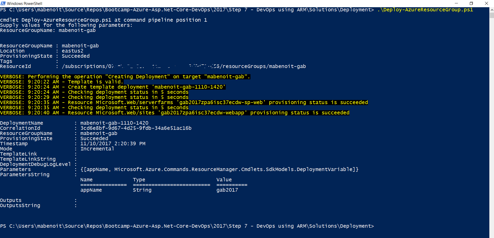
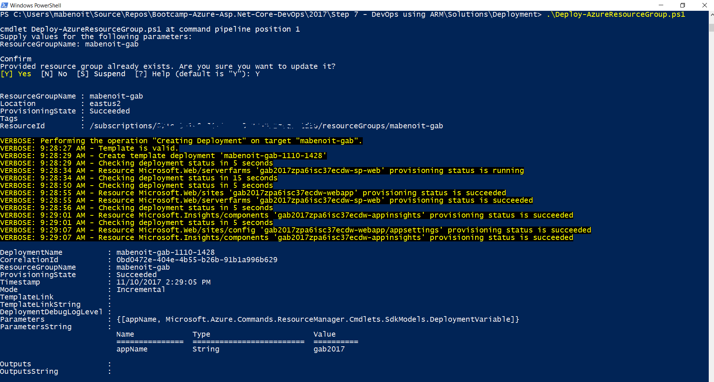

# Goal
FInally you will automate the creation of the resources the application requires in Azure. This is commonly referred to as Infrastructure as Code (IaC). To do this youy will be using a Visual Studio Resource Group project. You will start from an empty resource group template project in Visual Studio and add the needed resources to it.

# Requirements
* Azure PowerShell v3.7.0 or later. Get it [here](https://github.com/Azure/azure-powershell/releases/tag/v3.7.0-March2017).

# Reference
* https://docs.microsoft.com/en-us/azure/azure-resource-manager/resource-group-overview
* https://docs.microsoft.com/en-us/azure/azure-resource-manager/resource-manager-create-first-template
* https://docs.microsoft.com/en-us/azure/azure-resource-manager/vs-azure-tools-resource-groups-deployment-projects-create-deploy
* https://docs.microsoft.com/en-us/cli/azure/
* https://docs.microsoft.com/en-us/powershell/azure/overview

# Let's code!
## Login in to Azure and select the right subscription

- Open a PowerShell window
  - Change the directory to the DevOps step directory. `cd '{RepositoryPath}\2018\Step 7 - DevOps using ARM\Solutions\Deployment'`
  - `Login-AzureRmAccount`
  - `Select-AzureRmSubscription -Subscription {SubscriptionId}`

**!! You can find your '{SubscriptionId}' on the Azure portal on any "Overview" blade of the Azure resources you deployed earlier today.**

The goal of the steps below is to copy/paste snippets from the folder `{RepositoryPath}\2018\Step 7 - DevOps using ARM\Code snippets` into the `{RepositoryPath}\2018\Step 7 - DevOps using ARM\Solutions\Deployment\azuredeploy.json` file.

## Add Azure Web App and App Service Plan

- Open the file `1-parameters.json` and copy/paste the content into the `parameters` section of the `azuredeploy.json` file.
- Open the file `1-variables.json` and copy/paste the content into the `variables` section of the `azuredeploy.json` file.
- Open the file `1-resources.json` and copy/paste the content into the `resources` section of the `azuredeploy.json` file.
- Save the `azuredeploy.json` template file and call `Deploy-AzureResourceGroup.ps1` in your PowerShell window.

**Just in case, you can find the final expected state of the `azuredeploy.json` file in the `azuredeploy-1.final.json` file**

## Add Application Insights 

- Open the file named `2-variables.json` and copy/paste the content into the `variables` section of the `azuredeploy.json` file (by adding it after the `webApp` variable).
- Open the file named `2-resources.json` and copy/paste the content into the `resources` section of the `azuredeploy.json` file (by replacing the whole `WebApp` resource).

    **!! Take great care to replacing the whole `WebApp` resource with the new snippet content.**

- Save the `azuredeploy.json` template file and call `Deploy-AzureResourceGroup.ps1`

**Just in case, you can find the final expected state of the `azuredeploy.json` file in the `azuredeploy-2.final.json` file**

To conclude this deployment, open the Azure portal and review the Azure resources you just deployed. Verify the **Deployments** blade of your resource group and see what happened.

# Bonus

- In Visual Studio, you could use the **JSON Outline** View to edit your azuredeploy.json ARM Template --> it's a graphical editor to add basic resources.
- In the Azure portal, go to the resource group you just deployed and click on the **Locks** blade. Here add a `DoNotDelete` lock (**Lock type** = `Delete`). This is a good practice to protect your Azure resources, especially for Production. Don't forget you could also automate this through PowerShell for example ;)

# End